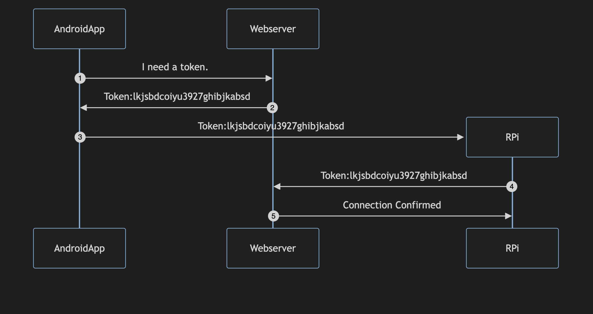
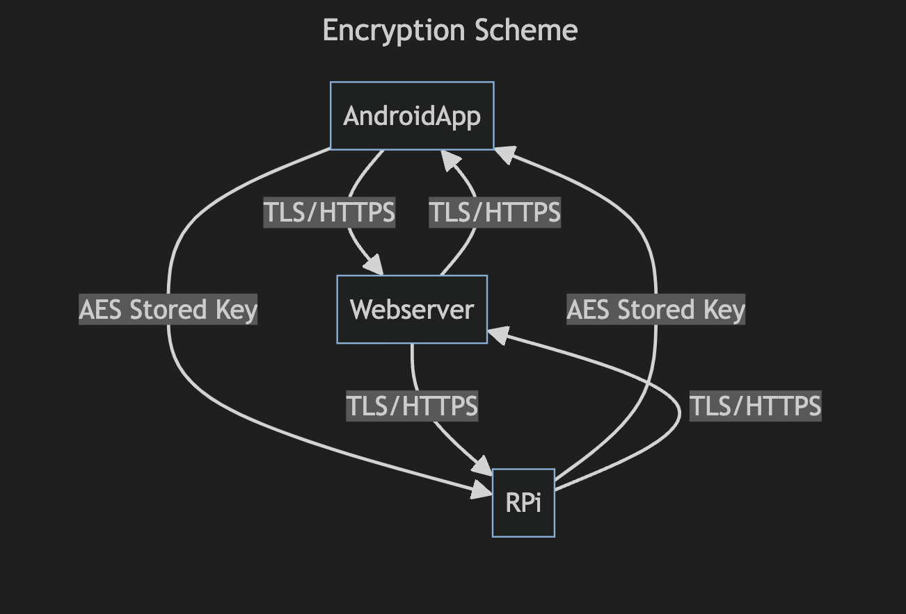
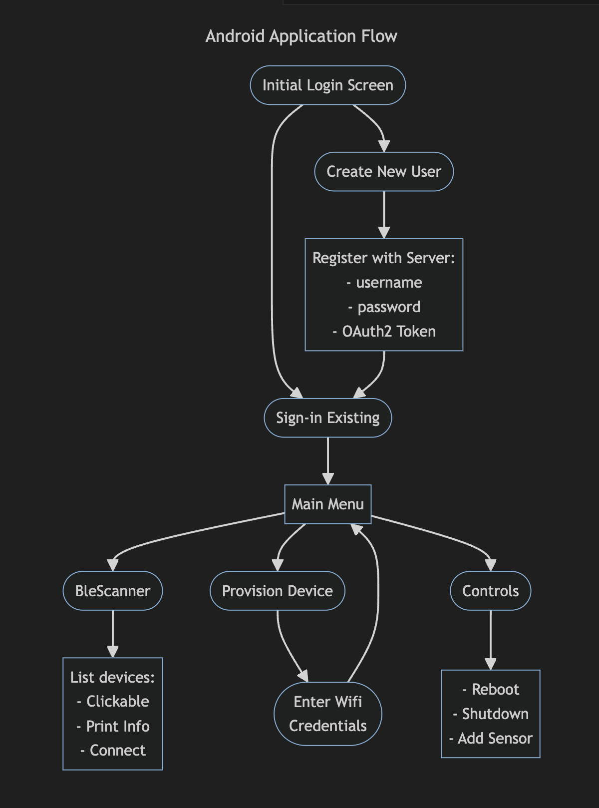

# SafePi-Embedded
This is the repository for the embedded SafePi platform. 

TODO:
- Add an actual LED to test the blinking and solid light functions for indicating wifi connection.
- Add two wires that I can touch together to represent the door lock, sending the post update. 
- Implement OAuth2 client. We already have a token passing command handler, but we may need to pass more than that. We'll likely need to store and setup some environment variables that can be updated with the information to be stored. There should be one owner, and we'll keep just those credentials.
- What should we write to the read characteristic? Perhaps we should define different characteristics to post statuses of various things. We could  even post debug messages, not that those are really needed at this point.

## Setup RPi4:
For instructions on how to image your micro SD card with Ubuntu Server 23.10, follow this link [HERE](https://ubuntu.com/tutorials/how-to-install-ubuntu-on-your-raspberry-pi#1-overview). 

IMPORTANT: Before you put the burn the image onto the sd card, you will be prompted to use custom setting. You should consider setting up you wifi, local host name, and ssh with password auth enabled. This will allow you to completely skip the wifi and ssh sections below. You would then ssh in with this form of command (assuming hostname is SafePi):
```
ssh <usernam>@safepi.local
```

 After the system has been installed, boot the image and login with username:```ubuntu``` password:```ubuntu```. You will then be prompted to change you password.

### Wifi
Before we begin, consider setting up

If you have access to an ethernet connection, you can use that for now, but you will have to setup wifi eventually. If you would like to do this later, skip to to the *General Setup* section below.

 A yaml config was generated in the ```/etc/netplan/``` dir under various names depending on your system (mine was "50-cloud-init.yaml"). You might want to make a copy of this config before you edit it, but before you do this, you'll need the name of your wireless interface. Usually it's "wlan0", but this can be different, so check by running:
```
ip link show
# or if net-tools has been installed
ifconfig
```
Assuming your interface is "wlan0", and assuming you config is named "50-cloud-init.yaml", open and edit the yaml file with the editor of your choice. I prefer ```nano``` for these kinds of simple edits. 
```
sudo nano /etc/netplan/50-cloud-init.yaml
```
Edit the file to look like this:
```
# This file is generated from information provided by
# the datasource.  Changes to it will not persist across an instance.
# To disable cloud-init's network configuration capabilities, write a file
# /etc/cloud/cloud.cfg.d/99-disable-network-config.cfg with the following:
# network: {config: disabled}
network:
    version: 2
    ethernets:
        eth0:
            optional: true
            dhcp4: true
    # add wifi setup information here ...
    wifis:
        wlan0:
            optional: true
            access-points:
                "YOUR-SSID-NAME":
                    password: "YOUR-NETWORK-PASSWORD"
            dhcp4: true

```
NOTE: There are no quotations in the above strings, and your SSID is simply the name of you network.

After saving the config and exiting, we can test it with these commands:
```
sudo netplan --debug try
# or if the above fails, run this for more details
sudo netplan --debug generate
```
If the that returns good (ignore the permissions warning), then run this command to apply the configuration:
```
sudo netplan --debug apply
reboot
```

### Make Accessing (SSH) Great Again
The last thing you should set up before switching to SSH is the hostname so that you don't have to remember the IP everytime you want to ssh in. Run this command to set your hostname (assuming your hostname will be "safepi"):
```
sudo hostnamectl set-hostname safepi
```
Now open you hosts file like this:
```
sudo nano /etc/hosts
```
and add this line under the localhost:
```
127.0.0.1 safepi
```
Now you have to set a config to make sure that the hostname is persitent through reboots by editing this file:
```
sudo nano /etc/cloud/cloud.cfg
```
and setting the ```preserve_hostname``` to true.

```hostnamectl``` command to verify hostname. 

Lastly, you'll need to install this library, which will manage the mDNS resolution, allowing you to ssh in with your hostname:
```
sudo apt install avahi-daemon
```

Once that is installed, it's probably a good idea to reboot. Now you should be able to ssh in while inside your lan using this form:
```
ssh <username>@safepi.local
```

### General Setup
Run these commands to get started:

```
sudo apt update
sudo apt full-upgrade -y
reboot
```

When the RPi boots back up, go ahead and install some necessary libraries:
```
sudo apt install pip python3-venv
```
Now that pip is installed, clone the repo in whatever directory seems fit. I chose the home folder because that is the purpose of the device, and that is easier to deal with:
```
git clone https://github.com/Not-Cameron-Inc/SafePi-embedded.git
cd SafePi-embedded
python3 -m venv venv # make virtual env
source venv/bin/activate
pip install -r requirements.txt
```
IMPORTANT: Do not skip creating the python virtual environment. We will use it later for the startup service that runs as root. We'll point it directly to where these binaries are in the venv because pip does not install system winde. Virtual environments are also a great way to manage you dependencies. 


### Run BLE Server
To startup a BLE server, run this command from your repo's home dir:
```
python3 server.py
```
You can now open the nRF Connect app and view scan for the connection named SafePi. If you want to read and write data using the client app, then open this project on another device and run:
```
python3 client.py
```
### Creating a Startup Service:
This step is crucial for allowing our scripts to run on startup, and to make the necessary changes as a root user. Follow these instructions very carefully. Create a service with the following command:
```
sudo nano /etc/systemd/system/safepi.service
```
We will assume that the user is "safepi" as that was the default one, but if yours is different, then you'll have to change the paths in the below code to match. Paste this code in:
```
[Unit]
Description=Startup for SafePi BLE broadcast server.

[Service]
WorkingDirectory=/home/safepi/SafePi-embedded
Environment="PATH=/usr/local/sbin:/usr/local/bin:/usr/sbin:/usr/bin:/sbin:/bin:/usr/lib/aarch64-linux-gnu"
ExecStartPre=/bin/sleep 10
ExecStart=/home/safepi/SafePi-embedded/venv/bin/python3 safepi.py

[Install]
WantedBy=multi-user.target
```
Ctrl-s to save and ctrl-x to exit. Now enable the service and run it:
```
sudo systemctl enable safepi
sudo systemctl start safepi
sudo systemctl status safepi
```
The last "status" command should return a green active indicator with more text. Running this command will allow you to verify the service, and to see the debug messages. Reboot your system and then run the status command again to verify your service was setup correctly.

Run this command to monitor the service in real-time:
```
sudo journalctl -u safepi -f
```

## Diagrams
### Sequence:
This a sequence diagram for the initial device provisioning process:


### Encryption Scheme:
This is a chart of the encryption scheme for each connection:


### Android Application Flow Chart:
This shows the execution flow of the android app from the user perspective:


## References:
- [Setup wifi on ubuntu server](https://askubuntu.com/questions/1143287/how-to-setup-of-raspberry-pi-3-onboard-wifi-for-ubuntu-server-with-netplan/1143594#1143594?newreg=4bbf1c68180f4c128cc5125a64917a85)

- [LGPIO installation and tutorial](https://ubuntu.com/tutorials/gpio-on-raspberry-pi#2-installing-gpio)

- [Ubunter Server install for RPi](https://ubuntu.com/tutorials/how-to-install-ubuntu-on-your-raspberry-pi#1-overview)

- [nRF Connect mobile app description](https://www.nordicsemi.com/Products/Development-tools/nrf-connect-for-mobile)

- [LGPIO Docs](https://abyz.me.uk/lg/py_lgpio.html)

- [Blinking Light tutorial](https://raspberrypihq.com/making-a-led-blink-using-the-raspberry-pi-and-python/)

- [BLE Python Server](https://github.com/kevincar/bless)

- [BLE Python Client](https://github.com/hbldh/bleak)

- [Bleak Docs](https://bleak.readthedocs.io/en/latest/api/index.html)

- [Android BLE](https://github.com/NordicSemiconductor/Android-BLE-Library)