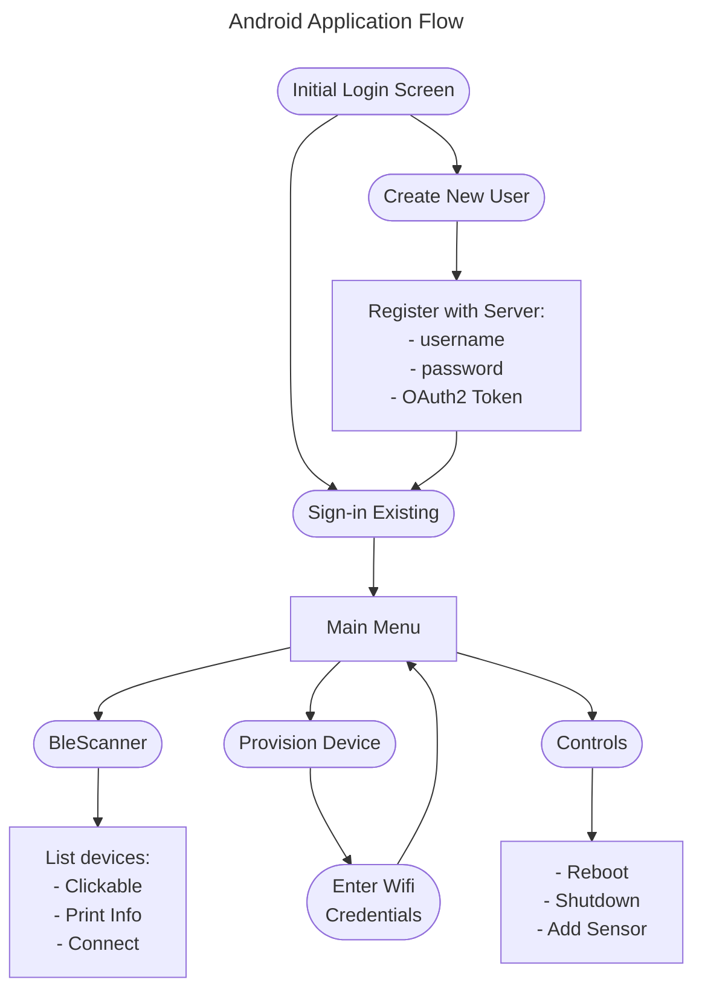

```mermaid
---
title: Android Application Flow
---
flowchart TD;
    A([Initial Login Screen]) --> B([Create New User]);
    A --> C([Sign-in Existing])
    C --> M[Main Menu]
    B --> D[Register with Server:
            - username
            - password
            - OAuth2 Token];
    D --> C
    M --> E([BleScanner])
    E --> F[List devices:
            - Clickable
            - Print Info
            - Connect]
    M --> G([Provision Device])
    G --> H([Enter Wifi 
             Credentials])
    H --> M
    M --> I([Controls])
    I --> J[- Reboot
            - Shutdown
            - Add Sensor]
```