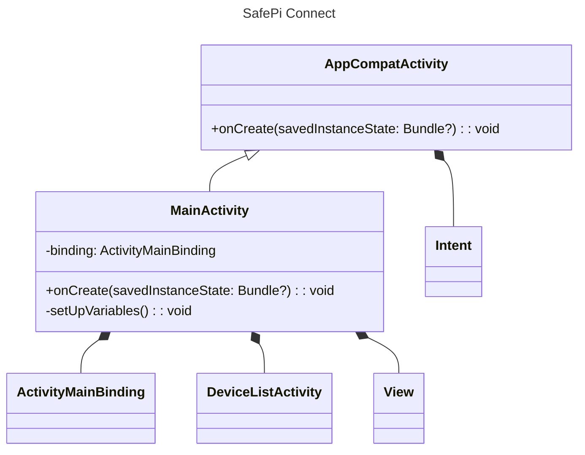

```mermaid
--- 
title: SafePi Connect
---
classDiagram
    class AppCompatActivity {
        +onCreate(savedInstanceState: Bundle?): void
    }
    class MainActivity {
        -binding: ActivityMainBinding
        +onCreate(savedInstanceState: Bundle?): void
        -setUpVariables(): void
    }
    class Intent
    class DeviceListActivity
    class ActivityMainBinding
    class View

    AppCompatActivity <|-- MainActivity
    AppCompatActivity *-- Intent
    MainActivity *-- ActivityMainBinding
    MainActivity *-- DeviceListActivity
    MainActivity *-- View


```